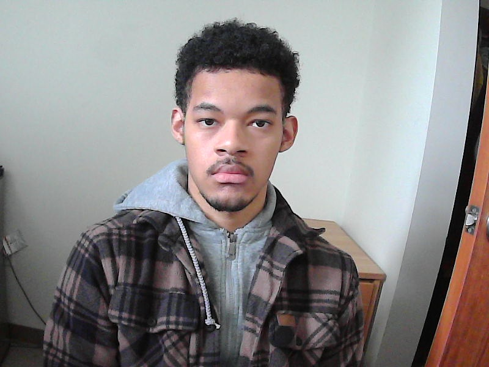
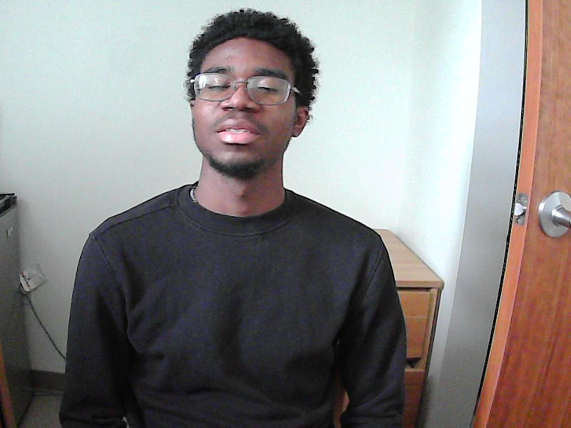

# AI Photography Co-Pilot (Jetson Nano + NVIDIA Nemotron)

A real-time edge-AI system that assists a photographer *while taking a photo*.

Instead of fixing photos in editing, the AI helps improve the photo **before the shutter is pressed** by guiding framing, positioning, and composition.

---

## 🎥 Live Demo

[](https://youtu.be/iMxgTugIAjQ)
---

## What the System Does
While the camera is pointed at a subject, the AI:

- Detects the subject in the frame
- Evaluates brightness and sharpness
- Checks framing and centering
- Detects occlusions (hands, masks, objects)
- Provides real-time positioning instructions
- Signals when the composition is ready

The photographer remains in control — the AI acts as an assistant.

---

## Example Results
Photos captured using the AI co-pilot:





---

## How It Works

### Fast Local Computer Vision (Jetson Nano)
Runs every frame:
- Face detection
- Centering analysis
- Brightness estimation
- Sharpness detection

### NVIDIA Nemotron VLM (Reasoning Layer)
Analyzes the image semantically:
- Pose orientation
- Subject gaze direction
- Obstructions
- Composition issues

This hybrid approach provides:
**real-time responsiveness + high-level reasoning**

---

## Tech Stack
- NVIDIA Jetson Nano (edge inference)
- Python + OpenCV
- NVIDIA Nemotron Nano 12B V2 VL (Vision-Language Model)

---

## Running the Project

Install dependencies:
```bash
pip install -r requirements.txt
